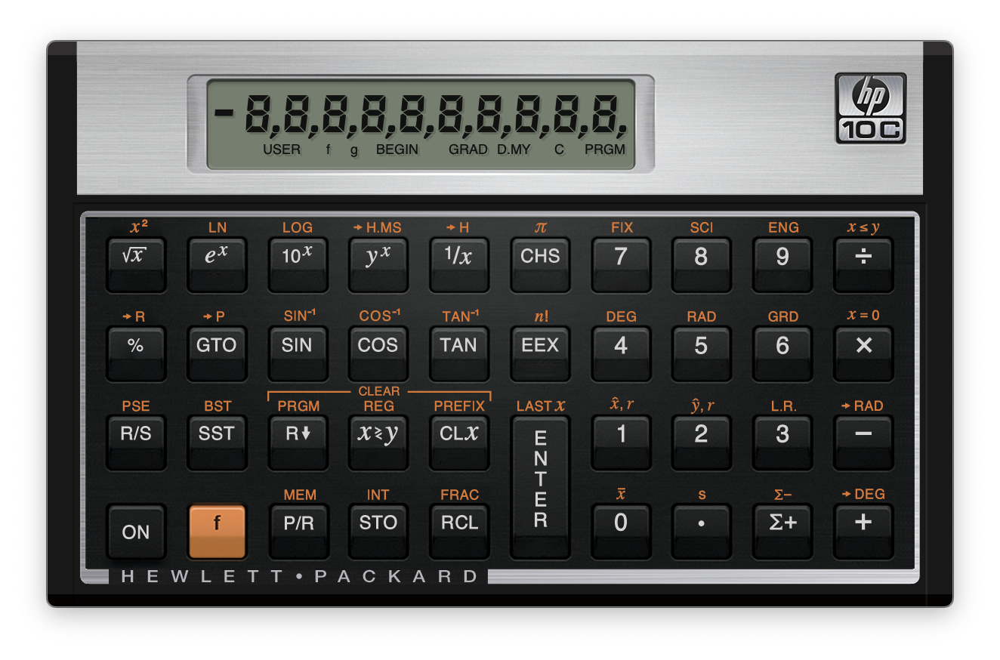
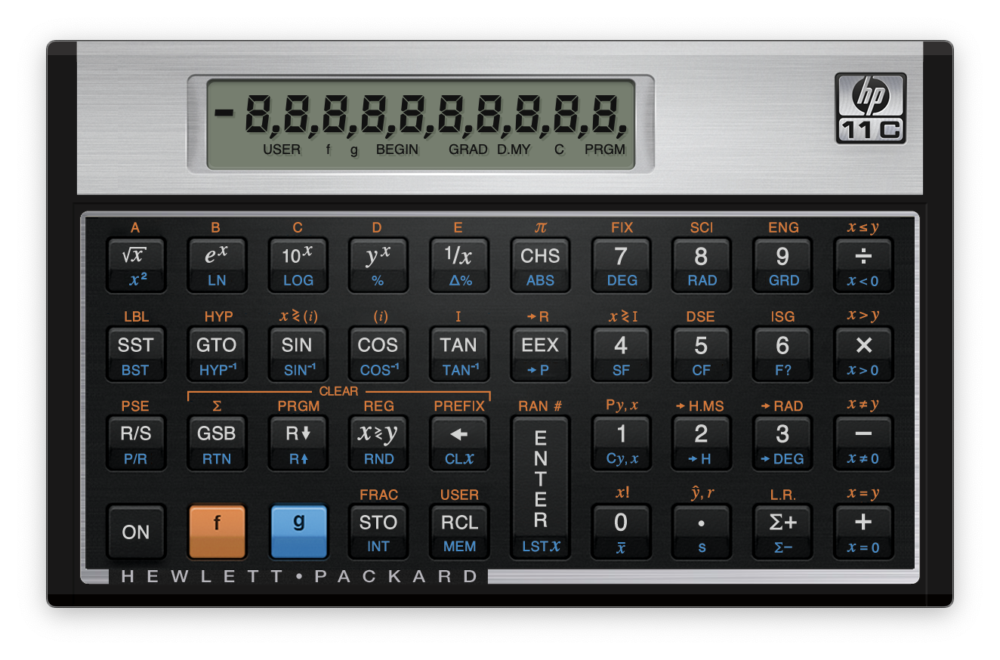
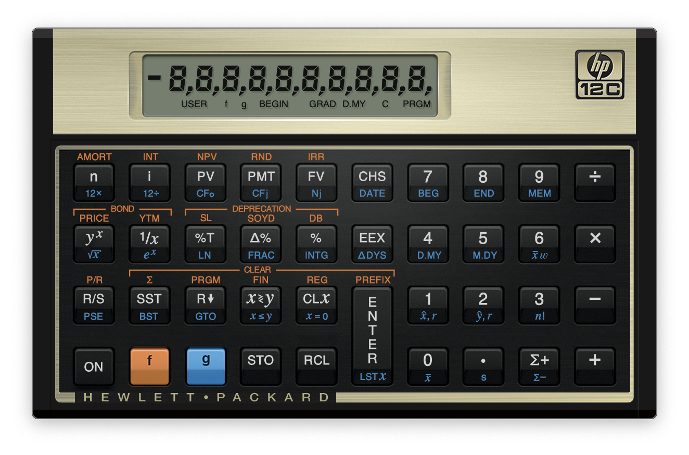
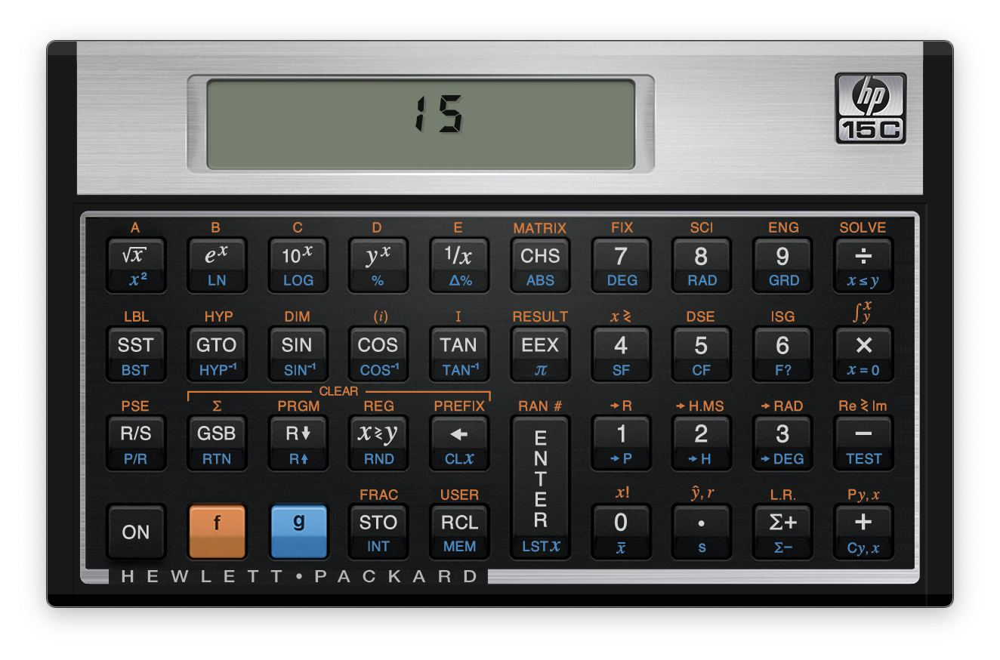
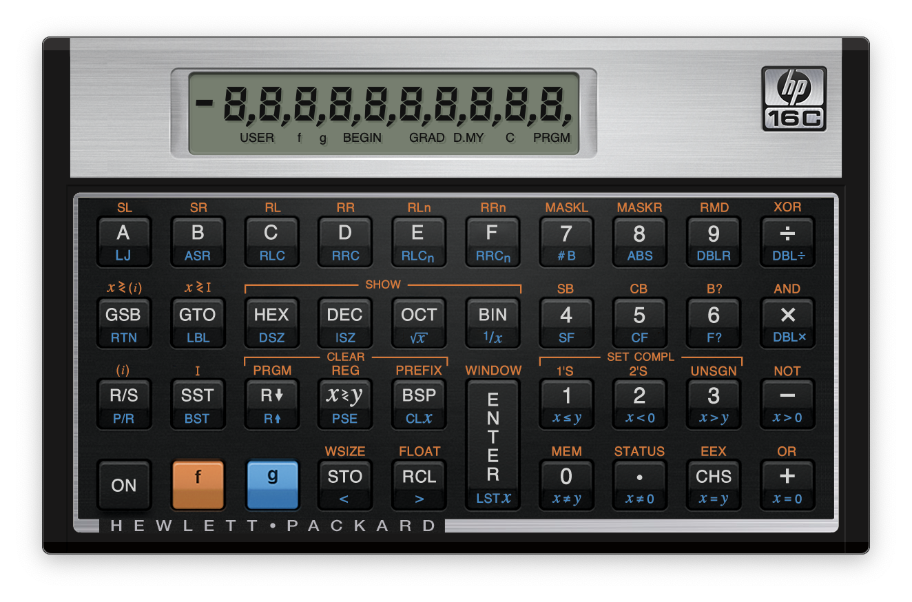
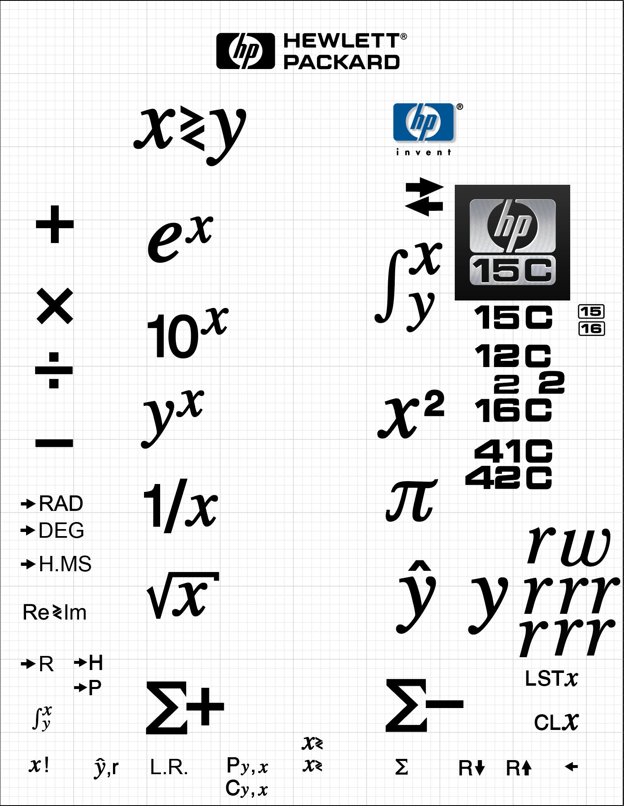
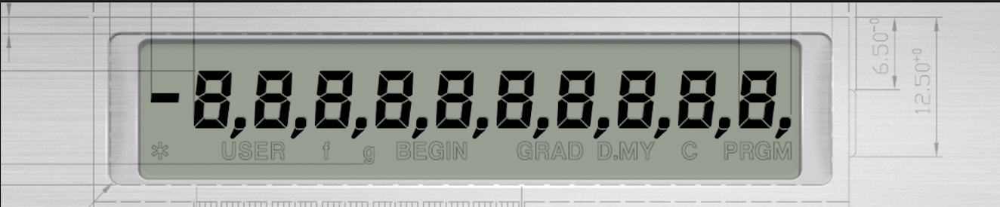
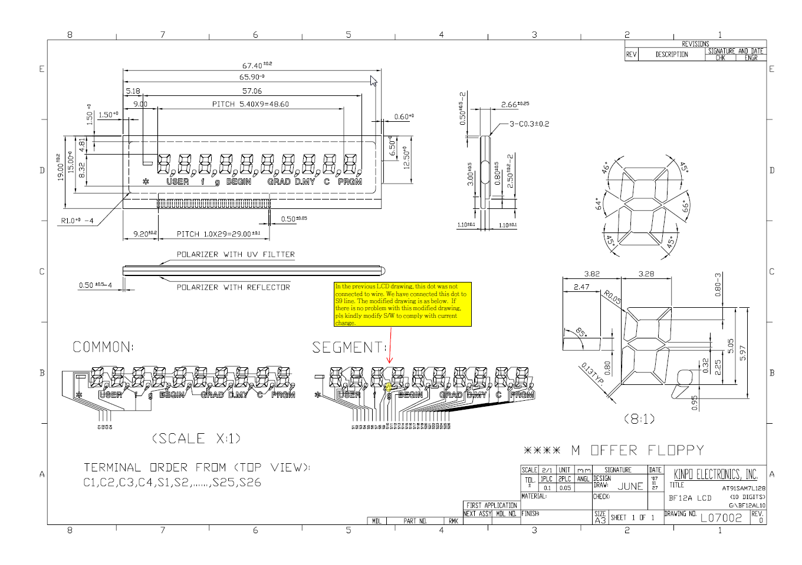

## Introduction

This repository is the home of Nonpareil Voyager Series.  A simulation of the Hewlett-Packard Voyager Series calculators for the macOS desktop.

The simulator reads into its simulated ROM memory, the original HP microcode of each calculator.  Then the Nut processor is started to begin the calculator simulation.

This repository is comprised of the Xcode project files and pre-built macOS Universal Binaries.  Minimum macOS version is 10.9.

This is not a product of Hewlett-Packard or its affiliates.

## Copyright © 2022 telemark software, llc.  All rights reserved.

This repository is governed by the GPL v3.0 license.

## Acknowlegements

Hewlett-Packard Voyager Series, Retina Graphics Interface & Enhancements, Copyright © 2022 Mark H. Shin, All Rights Reserved.

This work is based on Nonpareil 0.77 for Linux, by Eric Smith (Copyright 2004-2006 Eric Smith, the original developer of [Nonpareil](https://github.com/brouhaha/nonpareil).  

Additionally, the work of Maciej Bartosiak who originally ported Nonpareil to the Mac desktop, based on [nonpareil for MacOS](https://github.com/mbamac/nonpareil) (Copyright 2005-2012 Maciej Bartosiak).

Significant assistance by Alex Garza of the [HP Museum Forum](https://www.hpmuseum.org/forum/index.php), who was kind enough to share his HP-10C display segment map.

## Models

The following Voyager Series models have been implemented:
```
HP-10C Scientific Calculator
```

```
HP-11C Scientific Calculator
```

```
HP-12C Financial Calculator
```

```
HP-15C Scientific Calculator
```

```
HP-16C Computer Scientist
```



## Implementation

Notice a very subtle drop shadow for the LCD display segments and annunciators, and of course working pressed buttons.

The entire keyboard for each calculator was implemented using a customized version of the HP Voyager Series keyboard font.

Keyboard font study in Adobe Illustrator:



The display's digit segments and punctuations are drawn using closed Bezier paths and distributed across the display.  The simulator fills the Bezier paths of each segment based on the values of Register 9 & Register 10 of the Voyager's R2D2 controller, rendering each digit and punctuation.

The annunciators are drawn as text using HP Helvetica font.  It was determined the annunicators would render better at the required size using a font rather than filled Bezier paths.

The digits for the logo use an old font typically used for television channel dials called Television P01 & Television P02, which are designed to be highly readable and distinct.

Of note is the low battery indicator, which is never actually displayed in these simulations.  It appears quite similar to the Unicode Heavy Asterisk (U+2731) character in the drawing, but the production models display a distinctly thinner version.



The shape of the digit segments are derived directly from an engineering drawing of the HP Voyager display.
```
Kinpo Electronics, Inc. BF12A LCD Engineering Drawing
```


Notes:  Apparently, this was an early draft in the process of final approval.  The electrical traces were still in the process of finalization.

## Get Up & Running

Download the desired calculator release, unpackage, and run.  Or download the Xcode source and build your very own macOS application!

## Development Platform

Xcode XIB user interface, Cocoa Framework with Objective-C and C languages.

## Some usage notes

The first time the calculator is run, you will need to turn it on using the ON button.  "Pr Error" should be displayed indicating continous memory has been reset.  Subsequent restarts will load continous memory and state.

Input via the numeric keypad is supported.
```
The 'O' key can be used as the ON key.
The 'O' + ',' key can be used to toggle digit separator.
The 'O' + '.' key can be used to toggle digit separator.
```
Additional options are:
```
Command K
```
Toggle key click button press sound.
```
Command +
```
Increase LCD display contrast.
```
Command -
```
Decrease LCD display contrast.

## Self-Tests

Pressing 'O' + '*' (on numeric keypad) simultaneously will perform a compelete self-test in which all segments/annunicators should be displayed upon successful completion.

Pressing 'O' + '/' (on numeric keypad) simultaneously will perform the keyboard test in which each key on each row is pressed in succession (Enter key is pressed once for row 3 and again for row 4).  The model number of the calculator should be displayed upon successful completion.

On the iMac Pro with Retina 5K display, the calculator interface is absolutely stunning!

Enjoy!

Mark H. Shin

mshin10@hotmail.com

Copyright © 2022 telemark software, llc.  All rights reserved.